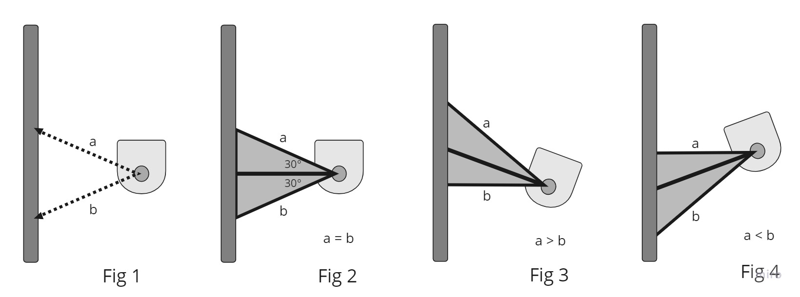
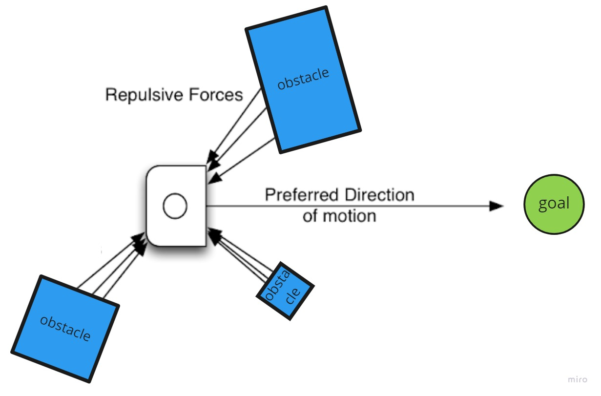
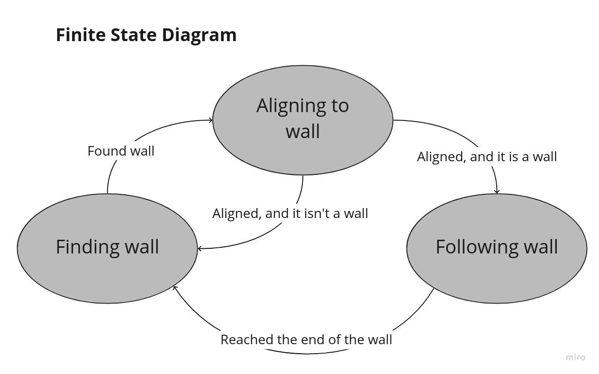

# Comprobo Warmup Project

*ENGR3590: A Computational Introduction to Robotics, Olin College of Engineering, FA2022*

*Simrun Mutha and Melody Chiu*

## Introduction

The objective of this warmup project is to gain familiarity with ROS and brush up on Python through programming the following robot behaviors using data from the laser range finder and bump sensors:

* [Teleoperation](#teleoperation)
* [Driving a Square](#square-driver)
* [Wall Following](#wall-following)
* [Person Following](#person-following)
* [Obstacle Avoidance](#obstacle-avoidance)
* [Finite State Controller](#finite-state-controller)

Through working on this project, we've learned strategies for debugging robotics programs and gained familiarity with finite-state robot control. We ran our programs on the [Neato](https://neatorobotics.com/) robot vacuum, both physically and in simulation through [Gazebo](https://gazebosim.org/home).

## Teleoperation

[[source]](warmup/warmup/teleop.py)

The teleoperation ("teleop") node is used to control the motion of the robot through the ROS network. Our implementation uses key binding to assign specific robot actions to certain key inputs. The WASD keys are to command the robot to move forwards, backwards, rotate left and right, and the spacebar commands the robot to stop.

## Driving a Square

[[source]](warmup/warmup/drive_square.py)

## Wall Following

[[source]](warmup/warmup/wall_follower.py)

The goal for this behavior is to have the Neato move forward while aligning its direction of motion to be parallel to the nearest wall. 

 Video of wall following in <a href="https://github.com/ros2/rviz">Rviz</a> at x5 speed 

Our implementation involves using data from the laser range finder to determine whether the robot should 1) keep driving straight, 2) steer slightly to the left or 3) steer slightly to the right in order to keep parallel to the wall. As Fig 1 shows, we looked at the laser range finder data values at 60 degrees (a) and 120 degrees (b) to determine how the robot was oriented relative to the wall. Fig 2 shows how these two values are very close when the robot is parallel to the wall, indicating that the robot should keep driving straight. In Fig 3, we can see how (a) is greater than (b) when the robot is oriented slightly to the right, indicating that it should steer slightly to the left in order to keep parallel with the wall. Fig 4 follows the same logic, indicating that the robot should steer slightly to the right in order to keep on track.

## Person Following

[[source]](warmup/warmup/person_follower.py)

 Video of person following in RViz at x2 speed 

## Obstacle Avoidance

[[source]](warmup/warmup/obstacle_avoidance.py)

The goal for this behavior is to have the Neato move towards a goal while reactively avoiding obstacles that block its path.

 Video of obstacle avoidance in RViz at x5 speed 

Our implementation uses the concept of potential fields, where the vector pointing towards the goal acts as a force constantly pulling the robot forward while nearby obstacles (detected by the laser range finder) exert repellant forces on the robot. The obstacle vectors are also weighed based on the laser range values, which effectively increases the magnitude of the repellant force as the robot gets closer to the obstacle.

By summing the obstacle vectors and the goal vector, we obtain a direction of motion for the robot to steer towards the goal, which also avoiding obstacles.

## Finite State Controller

[[source]](warmup/warmup/finite_state_controller.py)

